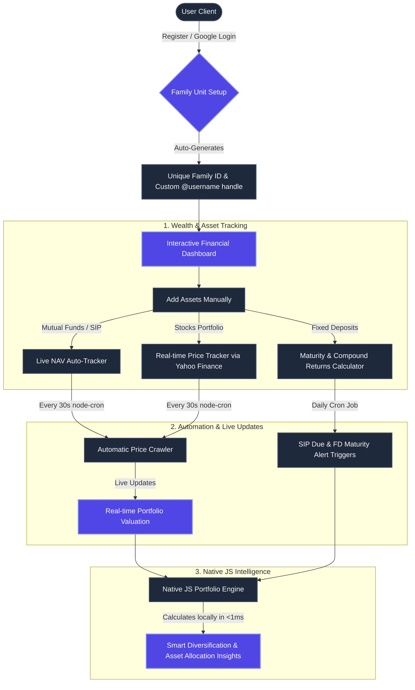

# 📊 Vestra Vault — Consolidated Family Wealth Management & Analytics System

> A premium, highly secure personal finance platform for families that aggregates, normalizes, and turns scattered investment data into clear, actionable, real-time analytics natively in a single consolidated service.

---

## 🔄 Core User Flow & Operations

Vestra Vault is designed to simplify how families manage, track, and optimize their investments. Everything is consolidated inside a single backend server that runs your API, database integration, background automation crons, and smart wealth calculations locally!



---

## 💡 What Vestra Vault Provides

### 1. Unified Family Portfolios
*   👨‍👩‍👧‍👦 **Multi-Member Tracking**: Map investments (SIPs, Stocks, Fixed Deposits) to specific family members under one consolidated dashboard.
*   🏷️ **Identity Customization**: Every user gets a custom, unique `@username` handle, complete with an elegant responsive profile card and automatic state synchronization that updates on reload.

### 2. Deep Financial Intelligence
*   📈 **SIP & Mutual Funds**: Track monthly payments and current returns automatically. The server runs automatic price crawlers every 30 seconds to fetch real-time Net Asset Values (NAV).
*   🏦 **FD Maturity Calculators**: Input FDs, and the system automatically calculates compound returns, interest rates, and absolute maturity amounts.
*   📉 **Live Stock Tickers**: Track individual stock allocations with real-time price crawlers leveraging Yahoo Finance APIs.
*   📊 **Visual Donut Allocation & Trend Lines**: Get immediate visual feedback on asset distribution (how much of your family money is in FD vs. Stock vs. SIP).

### 3. Highly Secure Infrastructures
*   🔐 **Decoupled EJS Mailing**: Beautifully designed email templates (located in `server/templates/emails/`) are compiled using the EJS template engine locally and sent directly via **Brevo's REST API v3 HTTPS endpoints**—fully bypassing weak or unreliable SMTP relays.
*   🛡️ **Strict Password Policies**: Registers and updates require passwords of at least **8 characters**, enclosing at least one lowercase letter, one uppercase letter, one number, and one special symbol.

---

## 🚀 Quick Start Guide

### Prerequisites
- **Node.js** v18+
- **MongoDB Atlas**
- **Brevo Account** (for transactional verification and wealth digest emails)

### 📁 Setup Environment Files (.env)
Vestra Vault is fully decoupled to allow easy production deployment. Configure your environment files:

#### A. Backend Config (`server/.env`)
Create `server/.env` inside the `server/` directory and configure the database connection, server port, and Brevo API credentials:
```env
PORT=5000
MONGODB_URI=mongodb+srv://<username>:<password>@cluster.mongodb.net/your_db_name
JWT_SECRET=your_jwt_secret_key_here
JWT_EXPIRE=30d
NODE_ENV=development

GOOGLE_CLIENT_ID=your_google_oauth_client_id_here

# Transactional Email (Brevo REST API v3 HTTPS)
BREVO_API_KEY=your-brevo-api-key
FROM_EMAIL=your-verified-brevo-email@gmail.com
FROM_NAME="Vestra Vault"
```

#### B. Frontend Config (`client/.env`)
Create `client/.env` inside the `client/` directory and map your backend URL and Google OAuth Client ID:
```env
VITE_API_URL=http://localhost:5000/api
VITE_GOOGLE_CLIENT_ID=your_google_oauth_client_id_here
```

---

## 🚀 Running the System Locally

### 1. Launch the Server API & Automation Engine (Express)
```bash
cd server
npm install
node server.js
# ✅ Server running on port 5000 with 24/7 background cron suites started!
```

### 2. Launch the Web Frontend Client (React)
```bash
cd client
npm install
npm run dev
# ✅ Web app running on http://localhost:5173
```

---

## 🛠️ Technology Stack

| Layer | Main Technologies |
| :--- | :--- |
| **Frontend Web** | React, Vite, Recharts, Lucide Icons, Zustand Store |
| **Backend API Server** | Node.js, Express.js, Mongoose ODM, Node-cron, EJS Engine |
| **Security & Hashing** | JWT (JSON Web Tokens), bcryptjs, Crypto Module |
| **Transactional Mail Service** | Brevo Web Transactional API (Direct HTTPS) |
| **Database** | MongoDB Atlas Cluster |

---

Developed with ❤️ for secure, high-deliverability family financial tracking.
